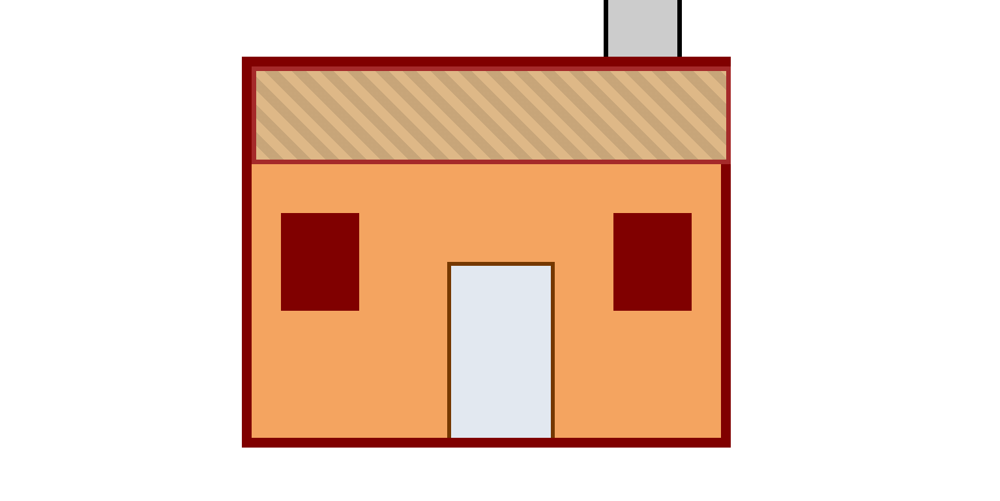

# House Painting

Exercice CSS consistant à créer une illustration de maison entièrement construite avec des `
` positionnés, dans le cadre du module Positioning de freeCodeCamp.

 

## Aperçu

## Technologies

 

## Démo en direct

🔗 [Voir sur GitHub Pages](https://docaridr.github.io/house-painting-freecodecamp/)

## Ce que j'ai appris

- **Positionnement absolu** : chaque élément de la maison (cheminée, toit, fenêtres, porte) est placé avec `position: absolute` à l'intérieur d'un conteneur `position: relative`, ce qui permet de contrôler précisément leur emplacement les uns par rapport aux autres.
- **`z-index` et empilement** : gestion de l'ordre d'affichage des éléments superposés (la cheminée doit apparaître au-dessus du toit) grâce à la propriété `z-index`.
- **Différence positionnement relatif vs statique** : le conteneur `#house` utilise `position: relative` comme point de référence, sans se déplacer lui-même du flux normal du document.
- **`box-sizing: border-box`** : correction d'un décalage de dimensions causé par l'ajout des bordures aux largeurs déclarées — les bordures sont désormais incluses dans la largeur/hauteur totale.
- **Accessibilité des illustrations en CSS pur** : ajout de `role="img"` et `aria-label` sur le conteneur global, pour qu'un lecteur d'écran perçoive une description cohérente de l'image plutôt qu'une série de `
` vides.

## Auteur

**DocariDR**
[GitHub](https://github.com/DocariDR) · [LinkedIn](https://linkedin.com/in/docaridr) · [X](https://x.com/docaridr) · [Bluesky](https://bsky.app/profile/docaridr.bsky.social)
